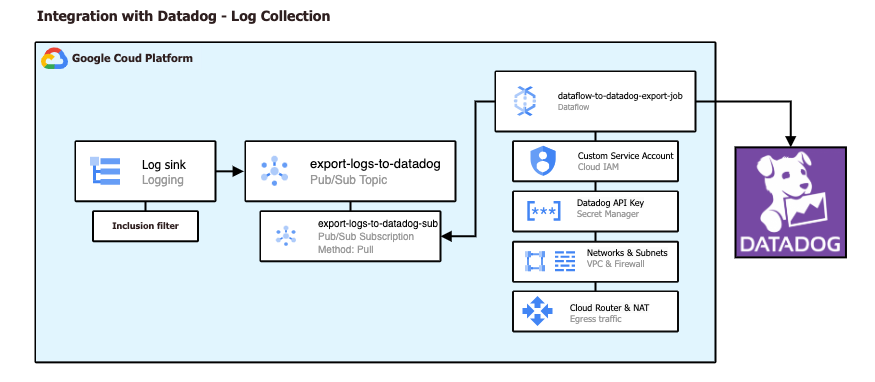

# Log Collection Integration - Google Cloud Platform to Datadog

This Terraform module automates the integration between **Google Cloud Platform and Datadog for Log collection**, making the process faster and more efficient. It builds upon the foundational overview provided in the official [Datadog guide](https://docs.datadoghq.com/integrations/google_cloud_platform/#log-collection). The module simplifies integration, accelerates implementation, and addresses essential security considerations for a successful observability strategy.

While this module provides security foundational principles, it's essential to note that in highly sensitive or production Google Cloud environments, additional layers of security and design principles should be thoughtfully analyzed and applied to uphold the highest standards of data protection and security principles (e.g. Utilize a bucket for TF state backup and encryption, egress traffic flow analysis, apply the module across various folders, disruption analysis, etc).

These deployment scripts are provided 'as is', without warranty. See [Copyright & License](https://github.com/googlecloudplatform/terraform-gcp-datadog-integration/blob/main/LICENSE).

## Solution diagram



## Resources created

- `google_logging_folder_sink` OR `google_logging_project_sink`: Logs forwarder from Google Cloud Logging to Pub/Sub.
- `google_pubsub_topic` & `google_pubsub_subscription`: Service that handles the Logs sent by Cloud Logging and delivers it to Dataflow.
- `google_pubsub_topic` & `google_pubsub_subscription` (dead-letter): Handles log messages rejected by the Datadog API for troubleshooting.
- `google_secret_manager_secret` & `google_secret_manager_secret_version`: Used to store the Datadog API Key in a secure way.
- `google_service_account`: Dedicated service account for Dataflow workers with minimal required permissions.
- `google_dataflow_job`: Create the Dataflow worker machines (Compute Engine) and generate a Dataflow job to pull logs from Pub/Sub subscription and export it to Datadog.
- `google_storage_bucket`: Used to store Dataflow temporary files.
- `google_compute_region_network_firewall_policy` & `google_compute_region_network_firewall_policy_rule`: Used to allow traffic from Dataflow workers private IP's to Datadog.
- `google_compute_firewall` (2 rules): Used to allow internal traffic between Dataflow worker machines.
- `google_compute_router` (optional): Used to serve as the control plane for network packets and to be attached to Cloud NAT. Can be disabled if using an existing router.
- `google_compute_router_nat` (optional): Required for outbound connections to the internet for the Dataflow private IP's workers. Can be disabled if workers have external IPs or use an existing NAT - <span style="color:red"> **IMPORTANT**</span>: Take into account that if you already have virtual machines (VMs) in the same subnet as the one that Cloud NAT will use, those VMs will have outbound connectivity too.

**Note**: It's recommended to utilize a distinct project specifically for the deployment of all resources related to this integration.

## Prerequisites

- **APIs**: The module automatically enables required APIs via the `enabled_apis` variable (default includes: `secretmanager.googleapis.com`, `pubsub.googleapis.com`, `dataflow.googleapis.com`, `logging.googleapis.com`, `cloudresourcemanager.googleapis.com`, `iam.googleapis.com`, `serviceusage.googleapis.com`). You can customize this list if needed.
- Download `gcloud` CLI.
- Download `terraform` CLI.
- Ensure user's IAM policies have `secretmanager.versions.access` permissions applied.
- Perform `gcloud auth login` before performing terraform commands.
- A Virtual Private Cloud (VPC) - Required in the '**`vpc_name`**' input variable.
- A network subnet attached to the VPC with [Private Google Access](https://cloud.google.com/vpc/docs/private-google-access) enabled (Resources will be created in the subnet's region) - Required in the '**`subnet_name`**' input variable.
- Datadog API Key - Required in the '**`datadog_api_key`**' input variable
- Your Datadog Logs API URL (You can find it [here](https://docs.datadoghq.com/integrations/google_cloud_platform/#4-create-and-run-the-dataflow-job), **ensure** the site selector on the right part of the page is the correct for your Datadog site) - used in the '**`datadog_site_url`**' input variable
- A pre-selected inclusion filter for the logs you want to be sent to Datadog - <span style="color:red"> **IMPORTANT**</span>: To make the filter works using Terraform you must use _unquoted_ filters.

  Instead of **this**:

  ```python
  resource.type="gce_instance" AND protoPayload.methodName="v1.compute.instances.stop"
  ```

  Use **this**:

  ```python
  resource.type=gce_instance AND protoPayload.methodName=v1.compute.instances.stop
  ```

  If your desired filter is too complicated, start with a basic one or an empty one (_inclusion_filter = ""_). After running 'Terraform apply', you can easily adjust the filter in the sink configs manually.

## Usage

Fill the `main.tf` file with your input variables and from the root folder of this repo (where the `main.tf` file exists) run the **terraform init, plan, and apply** commands.<br><br>

### Use a Log sink at the folder level

```hcl
provider "google" {
  project = "my-gcp-project-id"
  region  = "us-east1"
}

provider "google-beta" {
  project = "my-gcp-project-id"
  region  = "us-east1"
}

module "datadog-integration" {
  source                    = "./gcp-datadog-module"
  project_id                = "my-gcp-project-id"
  name_prefix               = "datadog"  # Optional: prefix for all resources (default: "datadog")
  dataflow_job_name         = "datadog-export-job"
  dataflow_temp_bucket_name = "my-temp-bucket"
  dataflow_max_workers      = 3  # Optional: max autoscaling limit (default: 3)
  dataflow_machine_type     = "n1-standard-4"  # Optional: worker machine type (default: "n1-standard-4")
  topic_name                = "datadog-export-topic"
  subscription_name         = "datadog-export-sub"
  log_sink_name             = "datadog-export-sink"  # Optional: custom sink name (default: "datadog-export-sink")
  vpc_name                  = "vpc-name"
  subnet_name               = "subnet-name"
  subnet_region             = "us-east1"
  datadog_api_key           = "ab1c23d4ef56789a0bc1d23ef45ab6789"
  datadog_site_url          = "https://http-intake.logs.us5.datadoghq.com"
  log_sink_in_folder        = true
  folder_id                 = "123456789012"
  inclusion_filter          = "resource.type=gce_instance AND protoPayload.methodName=v1.compute.instances.stop"

  # Optional: Add custom labels to all resources
  labels = {
    environment = "production"
    team        = "google"
  }
}
```

### Use a Log sink at the project level

```hcl
provider "google" {
  project = "my-gcp-project-id"
  region  = "us-east1"
}

provider "google-beta" {
  project = "my-gcp-project-id"
  region  = "us-east1"
}

module "datadog-integration" {
  source                    = "./gcp-datadog-module"
  project_id                = "my-gcp-project-id"
  name_prefix               = "prefix"  # Optional: prefix for all resources (default: "")
  dataflow_job_name         = "datadog-export-job"
  dataflow_temp_bucket_name = "my-temp-bucket"
  topic_name                = "datadog-export-topic"
  subscription_name         = "datadog-export-sub"
  vpc_name                  = "vpc-name"
  subnet_name               = "subnet-name"
  subnet_region             = "us-east1"
  datadog_api_key           = "ab1c23d4ef56789a0bc1d23ef45ab6789"
  datadog_site_url          = "https://http-intake.logs.us5.datadoghq.com"
  inclusion_filter          = ""

  # Optional: Use existing Cloud Router instead of creating a new one
  # create_cloud_router = false
  # existing_router_name = "my-existing-router"

  # Optional: Disable Cloud NAT if workers have external IPs
  # create_cloud_nat = false
}
```

## Variables

### Required Variables

| Variable Name    | Type               | Description                                                                                                                                                                       | Example                                  |
| ---------------- | ------------------ | --------------------------------------------------------------------------------------------------------------------------------------------------------------------------------- | ---------------------------------------- |
| project_id       | string             | The ID of the Google Cloud project (6-30 chars, lowercase letters, numbers, hyphens).                                                                                             | "my-gcp-project"                         |
| subnet_region    | string             | Region of the existing subnet, **all resources will be created in this region.**                                                                                                  | "us-central1"                            |
| vpc_name         | string             | Name of the VPC used for Dataflow Virtual Machines.                                                                                                                               | "my-dataflow-vpc"                        |
| subnet_name      | string             | Name of the subnet used for Dataflow Virtual Machines.                                                                                                                            | "my-subnet-name"                         |
| datadog_api_key  | string (sensitive) | Datadog API Key for integration.                                                                                                                                                  | "ab1c23d4ef56789a0bc1d23ef45ab6789"      |
| datadog_site_url | string             | Datadog Logs API URL (see [Datadog documentation](https://docs.datadoghq.com/integrations/google_cloud_platform/#4-create-and-run-the-dataflow-job)). Must start with `https://`. | "https://http-intake.logs.datadoghq.com" |

### Optional Variables - Resource Naming & Organization

| Variable Name             | Type        | Description                                                                                                                         | Default Value                 | Example                                     |
| ------------------------- | ----------- | ----------------------------------------------------------------------------------------------------------------------------------- | ----------------------------- | ------------------------------------------- |
| name_prefix               | string      | Prefix for all resource names to avoid collisions. Set to empty string to disable. Max 10 chars, lowercase letters/numbers/hyphens. | "datadog"                     | "prod-dd"                                   |
| labels                    | map(string) | A map of labels to apply to all resources that support labels.                                                                      | `{}`                          | `{environment = "prod", team = "platform"}` |
| dataflow_job_name         | string      | Dataflow job name.                                                                                                                  | "datadog-export-job"          | "export-job"                                |
| dataflow_temp_bucket_name | string      | GCS Bucket for Dataflow temporary files (3-63 chars, lowercase letters/numbers/hyphens).                                            | "temp-files-dataflow-bucket-" | "my-temp-bucket"                            |
| topic_name                | string      | Name of the Pub/Sub Topic to receive logs from Google Cloud.                                                                        | "datadog-export-topic"        | "my-datadog-topic"                          |
| subscription_name         | string      | Name of the Pub/Sub subscription to receive logs.                                                                                   | "datadog-export-sub"          | "my-datadog-subscription"                   |
| log_sink_name             | string      | Name of the logging sink to route logs from GCP to Datadog.                                                                         | "datadog-export-sink"         | "custom-sink-name"                          |

### Optional Variables - Dataflow Configuration

| Variable Name         | Type   | Description                                                      | Default Value   | Example         |
| --------------------- | ------ | ---------------------------------------------------------------- | --------------- | --------------- |
| dataflow_max_workers  | number | Maximum number of Dataflow workers for autoscaling (minimum: 1). | 3               | 5               |
| dataflow_machine_type | string | Machine type for Dataflow worker VMs.                            | "n1-standard-4" | "n1-standard-2" |

### Optional Variables - Network Configuration

| Variable Name        | Type    | Description                                                                                                                                 | Default Value | Example              |
| -------------------- | ------- | ------------------------------------------------------------------------------------------------------------------------------------------- | ------------- | -------------------- |
| create_cloud_router  | boolean | Whether to create a Cloud Router for Dataflow workers. Set to false if using an existing router.                                            | true          | false                |
| create_cloud_nat     | boolean | Whether to create a Cloud NAT for Dataflow workers outbound traffic. Set to false if using an existing NAT or if workers have external IPs. | true          | false                |
| existing_router_name | string  | Name of an existing Cloud Router to use for Cloud NAT. Required when `create_cloud_nat = true` and `create_cloud_router = false`.           | ""            | "my-existing-router" |

### Optional Variables - Logging Configuration

| Variable Name      | Type    | Description                                                                              | Default Value | Example                      |
| ------------------ | ------- | ---------------------------------------------------------------------------------------- | ------------- | ---------------------------- |
| log_sink_in_folder | boolean | Set to true if the Log Sink should be created at the folder level.                       | false         | true                         |
| folder_id          | string  | Folder ID where the Log Sink should be created. Required if `log_sink_in_folder = true`. | ""            | "123456789012"               |
| inclusion_filter   | string  | Inclusion filter for logs to be forwarded to Datadog.                                    | ""            | "resource.type=gce_instance" |

### Optional Variables - API Management

| Variable Name              | Type         | Description                                                       | Default Value                                                                                                                                                                                                |
| -------------------------- | ------------ | ----------------------------------------------------------------- | ------------------------------------------------------------------------------------------------------------------------------------------------------------------------------------------------------------ |
| enabled_apis               | list(string) | List of GCP APIs to enable for the Datadog integration.           | `["secretmanager.googleapis.com", "pubsub.googleapis.com", "dataflow.googleapis.com", "logging.googleapis.com", "cloudresourcemanager.googleapis.com", "iam.googleapis.com", "serviceusage.googleapis.com"]` |
| disable_on_destroy         | boolean      | Whether to disable the APIs when destroying the module.           | false                                                                                                                                                                                                        |
| disable_dependent_services | boolean      | Whether to disable dependent services when destroying the module. | false                                                                                                                                                                                                        |

## Outputs

| Output Name                    | Description                                                          |
| ------------------------------ | -------------------------------------------------------------------- |
| dataflow_job_name              | The name of the created Dataflow job.                                |
| temp_files_bucket_name         | The name of the created temporary files bucket.                      |
| datadog_topic_name             | The name of the created Pub/Sub topic.                               |
| datadog_subscription_name      | The name of the created Pub/Sub subscription.                        |
| deadletter_topic_name          | The name of the dead-letter Pub/Sub topic for rejected log messages. |
| deadletter_subscription_name   | The name of the dead-letter Pub/Sub subscription.                    |
| dataflow_service_account_email | The email of the Dataflow service account.                           |
| secret_id                      | The ID of the Secret Manager secret storing the Datadog API key.     |
| log_sink_writer_identity       | The writer identity of the log sink (project or folder level).       |

## Additional Considerations

### Resource Naming

The module uses a `name_prefix` variable (default: "") to prefix all resource names, allowing multiple deployments in the same project without naming conflicts. Set `name_prefix = ""` to disable prefixing.

### Dead-Letter Queue

The module automatically creates a dead-letter Pub/Sub topic and subscription to capture log messages rejected by the Datadog API. Monitor this subscription to troubleshoot any delivery issues.

### Network Configuration Flexibility

- **Existing Cloud Router**: Set `create_cloud_router = false` and provide `existing_router_name` to use an existing Cloud Router.
- **Existing Cloud NAT**: Set `create_cloud_nat = false` if you already have a Cloud NAT configured or if your Dataflow workers have external IPs.
- **Important**: When using `create_cloud_nat = true`, you must either create a new router (`create_cloud_router = true`) or provide an existing one (`existing_router_name`).

### Dataflow Autoscaling

The module enables Dataflow autoscaling with a configurable maximum worker count (`dataflow_max_workers`, default: 3). Adjust this based on your expected log volume and processing requirements.

### Customization

The module is flexible and allows you to customize various aspects of the integration. Your specific Google Cloud organization might have unique requirements, so you may need to adjust the code to suit your particular situation (e.g., deploying the log sink across multiple folders or at the organization level, use a different solution for API key store, etc.)

## Authors

- **Diego González** - [diegonz2](https://github.com/diegonz2)

## Troubleshooting

- If the Dataflow job fails with a _"Workflow failed. Causes: There was a problem refreshing your credentials"_ error, rerun "terraform apply"
- If you receive errors about API's not being used/enabled in your project, wait some minutes and rerun "terraform apply"
